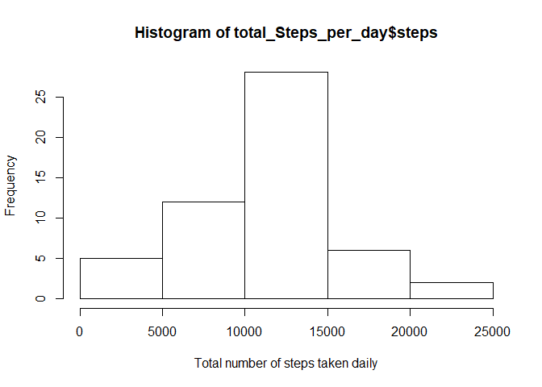
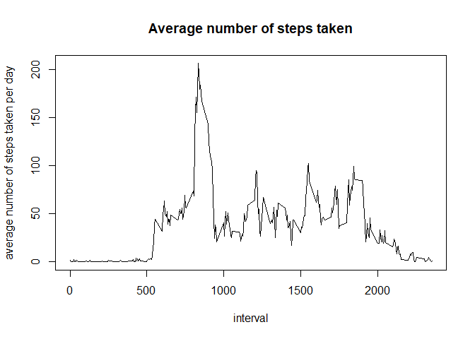
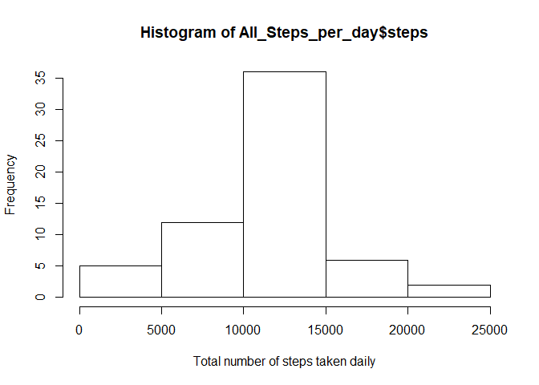

## Loading the data


```r
data <- read.csv("activity.csv")

head(data)
```

```
##   steps       date interval
## 1    NA 2012-10-01        0
## 2    NA 2012-10-01        5
## 3    NA 2012-10-01       10
## 4    NA 2012-10-01       15
## 5    NA 2012-10-01       20
## 6    NA 2012-10-01       25
```

## Calculate the total number of steps taken per day


```r
total_Steps_per_day <- aggregate(steps ~ date , data, FUN = sum)

head(total_Steps_per_day)
```

```
##         date steps
## 1 2012-10-02   126
## 2 2012-10-03 11352
## 3 2012-10-04 12116
## 4 2012-10-05 13294
## 5 2012-10-06 15420
## 6 2012-10-07 11015
```

##  histogram of the total number of steps taken each day


```r
hist(total_Steps_per_day$steps, xlab = "Total number of steps taken daily") 
```

<!-- -->

## Mean and median number of steps taken each day

```r
mean_Steps_per_day <- mean(total_Steps_per_day$steps, na.rm = T)
mean_Steps_per_day
```

```
## [1] 10766.19
```

```r
median_Steps_per_day <- median(total_Steps_per_day$steps, na.rm = T)
median_Steps_per_day
```

```
## [1] 10765
```

## Time series plot of the average number of steps taken


```r
avg_Steps_per_day <- aggregate(steps ~ interval , data, FUN = mean)
plot(avg_Steps_per_day$interval, avg_Steps_per_day$steps, type = "l", main = "Average number of steps taken", xlab = "interval", ylab = "average number of steps taken per day"  )
```

<!-- -->

## The 5-minute interval that, on average, contains the maximum number of steps

```r
max(avg_Steps_per_day$steps)
```

```
## [1] 206.1698
```

## strategy for imputing missing data
1. Total number of missing values


```r
missing_entries <- sum(is.na(data$steps))
missing_entries
```

```
## [1] 2304
```
2. Replace NA in the dataset with the mean.


```r
no_missing_data <- data
no_missing_data$steps [is.na(no_missing_data$steps)] <- mean(data$steps, na.rm = T)
```
3. calculate missing values again after replacing NA entries 

```r
no_missing_entries <- sum(is.na(no_missing_data$steps))
no_missing_entries
```

```
## [1] 0
```

##Histogram of the total number of steps taken each day after missing values are imputed


```r
All_Steps_per_day <- aggregate(steps ~ date , no_missing_data, FUN = sum)
head(All_Steps_per_day)
```

```
##         date    steps
## 1 2012-10-01 10766.19
## 2 2012-10-02   126.00
## 3 2012-10-03 11352.00
## 4 2012-10-04 12116.00
## 5 2012-10-05 13294.00
## 6 2012-10-06 15420.00
```

```r
hist(All_Steps_per_day$steps, xlab = "Total number of steps taken daily") 
```

<!-- -->

